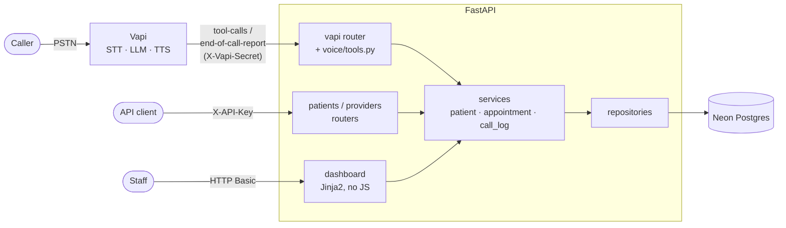

# Voice AI Patient Registration Agent

[](https://github.com/waleedharoonnnn/voice-patient-registration/actions/workflows/ci.yml)

A caller dials a US number and talks to **Sarah**, a voice agent that collects their
demographics conversationally, validates each field as they go, reads everything back,
saves the record, and offers a first appointment. A FastAPI service exposes the same data
through a REST API and a read-only staff dashboard, backed by Neon Postgres.
. .)

## Quick links

| What | Where |
|---|---|
| Phone number | **+1 (732) 782-5438** |
| API base URL | `<TBD after deployment>` (Vercel, `https://<project>.vercel.app`) |
| API docs (Swagger) | `<API base URL>/docs` |
| Dashboard | `<API base URL>/dashboard` (HTTP Basic) |
| Credentials | Sent separately. Never committed. |
| Requirement → code → test map | [`docs/requirements-traceability.md`](docs/requirements-traceability.md) |
| Test-call scenarios | [`docs/test-call-script.md`](docs/test-call-script.md) |

## Reviewer quick start

1. **Call** +1 (732) 782-5438 and register as a new patient, using obviously fake details.
   Try correcting a field during the read-back. Afterwards, accept the appointment offer.
2. **Check the API.** Set `API_BASE` and `API_KEY` from the credentials email, then:
   ```bash
   # Search by the phone number you gave on the call
   curl -s "$API_BASE/patients?phone_number=2125550100" -H "X-API-Key: $API_KEY"

   # Create a patient directly (MM/DD/YYYY and messy phone formats are accepted)
   curl -s -X POST "$API_BASE/patients" -H "X-API-Key: $API_KEY" -H "Content-Type: application/json" \
     -d '{"first_name":"Jane","last_name":"Doe","date_of_birth":"06/15/1985","sex":"Female",
          "phone_number":"(212) 555-0100","address_line_1":"123 Main St","city":"Springfield",
          "state":"IL","zip_code":"62704"}'

   # See validation errors in the standard envelope
   curl -s -X POST "$API_BASE/patients" -H "X-API-Key: $API_KEY" -H "Content-Type: application/json" \
     -d '{"first_name":"J4ne","date_of_birth":"01/01/2999"}'
   ```
3. **Open the dashboard** at `$API_BASE/dashboard`. The patient from your call appears
   with its transcript, summary and appointment.
4. **Call again from the same number.** Sarah finds the existing record and offers to
   update it (after verifying your DOB) instead of creating a duplicate.

## Architecture



**What happens during a registration call:**
1. Vapi transcribes the caller, and GPT-4.1 (driven by the system prompt) decides what to ask next.
2. The model calls `validate_fields` as data arrives. An `INVALID: <field>` result makes it
   re-ask for that field specifically.
3. After the phone number, it calls `find_patient_by_phone`. On a match it offers to update
   instead of create.
4. It reads everything back. On an explicit "yes" it calls `create_patient`, and the
   webhook runs `PatientService.create`. This is the same service the REST API uses.
5. The result string (`SAVED:` / `SAVE_FAILED:` …) is spoken back. When the call ends,
   `end-of-call-report` stores the transcript and summary against the patient.

**Layering** ([ADR 0002](docs/adr/0002-layered-architecture.md)): `api`/`voice` →
`services` → `repositories` → `models`/`db`, never upward. Routers and tool handlers hold
no business logic or SQL. Validation rules live once in `app/validation/`. Pydantic,
the voice tools and DB CHECK constraints all enforce them.

```
app/  core/ db/ models/ schemas/ validation/ repositories/ services/ api/ voice/ templates/ static/
migrations/  vapi/ (assistant.json, prompts/, tools/)  scripts/ (seed, sync_vapi)  tests/  docs/
```

## Tech stack

| Concern | Choice | Why |
|---|---|---|
| API | Python 3.12, FastAPI, Pydantic v2 | Typed validation, async, OpenAPI docs for free ([ADR 0001](docs/adr/0001-tech-stack.md)) |
| Data | SQLAlchemy 2.0 async + asyncpg, Alembic, Neon Postgres | Real constraints, migrations, serverless Postgres with branches |
| Voice | Vapi, config as code in `vapi/` | Telephony, STT, LLM and TTS in one platform, versioned in git ([ADR 0006](docs/adr/0006-voice-platform-and-model.md)) |
| Tooling | uv, ruff, mypy `--strict`, pytest, GitHub Actions | Reproducible from the lock file; strict types; tests on real Postgres |
| Hosting | Vercel Hobby (serverless, `iad1`); Dockerfile as the portable alternative | Free HTTPS next to Neon us-east and Vapi ([ADR 0010](docs/adr/0010-vercel-serverless-deployment.md)) |

Voice stack, with Vapi's per-component figures:

| Component | Choice | Cost | Latency |
|---|---|---|---|
| Transcriber | AssemblyAI Universal-Streaming (English) | $0.005/min | ~390 ms |
| LLM | OpenAI GPT-4.1, temperature 0.3 | $0.025/min | ~690 ms |
| Voice | Cartesia Sonic 3.5, "Aadhya - Soother" | $0.022/min | ~270 ms |
| **Total** | | **$0.052/min** | ~1.35 s |

Vapi's platform fee and telephony are billed on top. Any component can be rolled back
without a code change via `VAPI_TRANSCRIBER_OVERRIDE` / `VAPI_MODEL_OVERRIDE` /
`VAPI_VOICE_OVERRIDE` (ADR 0006).

## Voice agent design

- **Prompt:** [`vapi/prompts/system_prompt.md`](vapi/prompts/system_prompt.md), annotated
  with HTML comments that are stripped before upload. Explained section by section in
  [`docs/prompt-engineering.md`](docs/prompt-engineering.md).
- **Flow:** name → required fields in natural groups → duplicate check → optional fields
  offered (spec wording) → three-chunk read-back → save → appointment offer → "You're all
  set, [First Name]."
- **Tools** ([`docs/voice-tools.md`](docs/voice-tools.md)): `validate_fields`,
  `find_patient_by_phone`, `create_patient`, `update_patient`, `get_available_slots`,
  `book_appointment`, plus Vapi's `endCall`. Every tool returns a short, prefixed,
  speakable string (`VALID`, `INVALID`, `SAVED`, `SAVE_FAILED`, `BOOKED`, `SLOT_TAKEN`, …)
  and never raises, so the caller never hears silence.
- **Turn-taking** is tuned for digits and spelling: longer endpointing after numbers,
  Vapi smart endpointing, and quick barge-in.
- **Config as code:** `make sync-vapi` idempotently upserts tools, the assistant and the
  phone-number assignment. `make sync-vapi-dry-run` prints a field-level diff against the
  live assistant first.

## Data model

`patients` has every spec field (19), plus `deleted_at` (soft delete) and
`source_call_id` (voice idempotency). `call_logs`, `providers` and `appointments` support
the bonus features. Full columns, constraints and an ERD are in
[`docs/data-model.md`](docs/data-model.md), and the reasoning is in
[ADR 0003](docs/adr/0003-patient-schema.md). Key rules:
- Phone numbers are stored as 10 NANP digits.
- DOB is a `date` between 1900-01-01 and today (enforced by a trigger).
- State is a USPS code from an allow-list, and ZIP is 5 digits or ZIP+4.
- Timestamps are UTC `timestamptz`, with `updated_at` maintained by a trigger.

## API reference

All endpoints below need `X-API-Key`. Every response is `{"data": …, "error": null | {code, message, details}}`.

| Method | Path | Notes |
|---|---|---|
| GET | `/patients` | Filters: `last_name` (case-insensitive), `date_of_birth` (`MM/DD/YYYY` or ISO), `phone_number` (any format); `limit`/`offset` |
| GET | `/patients/{id}` | 404 if missing, soft-deleted, or not a UUID |
| POST | `/patients` | 201 with the created record and `patient_id` |
| PUT | `/patients/{id}` | Partial update; `updated_at` changes |
| DELETE | `/patients/{id}` | Soft delete (`deleted_at`); hidden from all reads afterwards |
| GET | `/patients/{id}/appointments`, `/patients/{id}/calls` | Bookings; call logs with transcript and summary |
| GET | `/providers` | Mock providers |
| POST | `/vapi/webhook` | Vapi only (`X-Vapi-Secret`) |
| GET | `/health`, `/health/ready` | Public: liveness; readiness (DB check, 503 if down) |

Status codes: 200, 201, 400 (malformed JSON), 401, 404, 413 (body too large), 422
(validation), 429 (rate limited, with `Retry-After`), 500 (generic message, never a stack
trace).

## Edge cases and resilience

| Situation | Behavior | Test |
|---|---|---|
| Invalid DOB (future, impossible date, pre-1900) | `validate_fields` → `INVALID: date_of_birth …`; Sarah re-asks only that field | validator unit tests |
| Call drops mid-registration | Nothing is saved until confirmation; the call log is marked `abandoned` for follow-up on the dashboard | `test_call_with_no_patient_is_marked_abandoned` |
| DB write fails, is slow, or the DB is down | `SAVE_FAILED` is spoken ("front desk will follow up"), never a 5xx or silence; 8 s tool timeout, 5 s statement timeout | `test_resilience.py` |
| Caller wants to start over | Sarah confirms once, then discards everything and restarts | manual (test-call script) |
| Corrections ("D-A-V-I-S, not D-A-V-I-E-S") | Read-back invites corrections; names are confirmed letter by letter | manual |
| Interruptions, out-of-order answers | Barge-in enabled; volunteered info is accepted and not asked again | manual |
| Duplicate caller (same phone) | Offers to update; DOB must match before any change (`IDENTITY_MISMATCH` otherwise) | `test_update_patient_identity_mismatch` |
| Vapi retries a tool call | `source_call_id` makes create/book idempotent (`ALREADY_SAVED`) | `test_create_patient_then_retry_same_call_id_is_idempotent` |
| Duplicate or malformed end-of-call report | Idempotent upsert; malformed payloads return 200 and are logged | `test_call_logs.py` |
| Two callers book the same slot | Partial unique index: exactly one wins, the other hears `SLOT_TAKEN` | `test_concurrent_booking_of_same_slot_exactly_one_wins` |

## Bonus features

| Bonus | How to try it |
|---|---|
| Duplicate detection → update | Call twice from the same number |
| Appointment scheduling (mock) | Say yes to the offer after registering ([ADR 0008](docs/adr/0008-mock-appointment-scheduling.md)) |
| Transcript and summary linked to patient | Dashboard patient page, or `GET /patients/{id}/calls` ([ADR 0007](docs/adr/0007-call-logs-and-transcripts.md)) |
| Dashboard | `/dashboard`: patients, search, per-patient calls and appointments, a follow-up queue of failed/abandoned calls ([ADR 0009](docs/adr/0009-server-rendered-dashboard.md)) |
| Automated API tests | `uv run pytest` (see Testing) |
| Multi-language (Spanish) | **Currently off.** The chosen English-only transcriber can't hear Spanish. The prompt still supports switching; re-enable with a multilingual transcriber override (ADR 0006) |

## Security and privacy

- **Secrets:** all secrets come from env vars. `.env` has never been committed (checked
  with gitleaks over the full history). `.env.example` has placeholders only.
- **Authentication:**
  - REST uses `X-API-Key`, the webhook uses a shared secret, and the dashboard uses HTTP Basic.
  - All comparisons are constant-time.
  - A test enumerates every route and fails if a non-public route answers without auth.
  - Only `/health*`, `/docs` and `/static` are public, and `/docs` can be switched off
    with `ENABLE_API_DOCS=false`.
- **Input limits:**
  - Server-side validation on every field, with max lengths.
  - 2 MB request body cap (413).
  - Per-IP rate limiting on everything except health checks and the Vapi webhook.
  - Parameterized SQL only.
- **Response hardening:**
  - Headers: `nosniff`, `X-Frame-Options: DENY`, `Referrer-Policy`, and HSTS (`ENABLE_HSTS`).
  - The dashboard adds a strict CSP, `no-store` and `noindex`.
  - CORS allows only explicit origins.
- **PII:** logs mask names and phone numbers unless `LOG_PII=true`. API keys and auth
  headers are never logged.
- **Data:** fake data only. This is a demo, **not HIPAA-compliant by design**: there's no
  BAA with Vapi, OpenAI, AssemblyAI, Cartesia or Neon, and no audit log.

## Observability

- JSON logs to stdout, one event per line, each with a `request_id` (and `call_id` for voice).
- Every request logs method, path, status and `duration_ms`. Bodies are never logged.
- Every tool call logs name, outcome and duration.
- A completed registration logs the final collected payload (masked).
- `GET /health` for liveness; `GET /health/ready` checks the DB.
- The dashboard's calls page shows every call's outcome, so failures are visible without
  reading logs.

## Local setup

**Prerequisites:** [uv](https://docs.astral.sh/uv/), Docker, a Neon project (or any
Postgres), and optionally a Vapi account and [ngrok](https://ngrok.com/) for real calls.

```bash
uv sync                       # Python 3.12 + locked dependencies
cp .env.example .env          # then fill in values (see below)
docker compose up -d          # local Postgres on :5544 for integration tests
uv run alembic upgrade head   # migrate (uses DATABASE_URL_DIRECT)
uv run python -m scripts.seed # optional: 2 fake patients
uv run uvicorn app.main:app --reload
```

**Environment variables:** the full list is in [`.env.example`](.env.example). The app
fails fast if a required one is missing.

| Name | Required | Description | Example |
|---|---|---|---|
| `DATABASE_URL` | yes | Neon **pooled** URL (asyncpg) used by the app | `postgresql+asyncpg://user:pw@ep-x-pooler…/neondb` |
| `DATABASE_URL_DIRECT` | yes | Neon **direct** URL, used by Alembic only | `postgresql+asyncpg://user:pw@ep-x…/neondb` |
| `API_KEY` | yes | REST API key (`X-API-Key`) | random 32+ chars |
| `VAPI_WEBHOOK_SECRET` | yes | Shared secret Vapi sends as `X-Vapi-Secret` | random 32+ chars |
| `DASHBOARD_USERNAME` / `DASHBOARD_PASSWORD` | yes | Dashboard HTTP Basic credentials | `admin` / random |
| `DB_SSL_REQUIRE` | no | `true` for Neon, `false` for local Docker | `true` |
| `TEST_DATABASE_URL` | tests | Local Postgres for integration tests | `…@localhost:5544/voiceai_test` |
| `APP_ENV`, `LOG_LEVEL`, `LOG_PII` | no | Environment name, log level, unmasked-PII switch | `dev`, `INFO`, `false` |
| `CORS_ORIGINS`, `RATE_LIMIT_DEFAULT` | no | Allowed origins; per-IP limit | `http://localhost:3000`, `60/minute` |
| `ENABLE_API_DOCS`, `ENABLE_HSTS`, `MAX_REQUEST_BODY_BYTES` | no | Hardening toggles | `true`, `false`, `2000000` |
| `DB_POOL_MODE` | no | `queue` (local/Docker) or `null` (Vercel: NullPool, no connections held between invocations) | `queue` |
| `DB_POOL_SIZE`, `DB_MAX_OVERFLOW` | no | Connection pool (queue mode only) | `5`, `10` |
| `RATE_LIMIT_CLIENT_IP_HEADER` | no | Client-IP header, only behind a proxy that overwrites it | `x-real-ip` on Vercel, unset elsewhere |
| `VAPI_TOOL_TIMEOUT_SECONDS`, `VAPI_WEBHOOK_DB_STATEMENT_TIMEOUT_MS` | no | Keep live calls from hanging | `8.0`, `5000` |
| `CLINIC_TIMEZONE` | no | Mock scheduling timezone | `America/New_York` |
| `VAPI_API_KEY`, `PUBLIC_BASE_URL`, `VAPI_PHONE_NUMBER_ID` | sync only | Needed only for `make sync-vapi` | Vapi **private** key; webhook host URL |
| `VAPI_TRANSCRIBER_OVERRIDE` / `_MODEL_` / `_VOICE_` | no | JSON voice-stack rollback (ADR 0006) | `{"model":"gpt-4o-mini"}` |

**Make targets** (each wraps a `uv run …` command, so you can run those directly if
`make` isn't installed):

| Target | Runs |
|---|---|
| `make run` | `uv run uvicorn app.main:app --reload` |
| `make check` | ruff check + ruff format --check + mypy + pytest |
| `make db-up` / `make db-down` | `docker compose up -d` / `down` |
| `make migrate` / `make seed` | `uv run alembic upgrade head` / `uv run python -m scripts.seed` |
| `make sync-vapi` / `make sync-vapi-dry-run` | `uv run python -m scripts.sync_vapi [--dry-run]` |

**Real calls against your local server:**
```bash
uv run uvicorn app.main:app --reload                 # terminal 1
ngrok http --domain=<your-ngrok-domain> 8000         # terminal 2
```
Set `PUBLIC_BASE_URL=https://<your-ngrok-domain>` in `.env`, run
`uv run python -m scripts.sync_vapi`, then call the number (or use **Talk to Assistant**
in the Vapi dashboard).

**Deployment:** Vercel is the target. `vercel.json` and `[tool.vercel]` in
`pyproject.toml` hold the config. See [`docs/deployment.md`](docs/deployment.md) for the
production env vars, migrate-first steps, repointing Vapi and rollback. A container host
works too: `docker build -t voiceai .` and
`docker run --env-file .env -p 8000:8000 voiceai`.

## Testing

```bash
docker compose up -d      # integration tests need the local Postgres
uv run ruff check . && uv run ruff format --check . && uv run mypy app
uv run pytest --cov=app
```

- **294 tests.** Unit tests cover validators, config and pure logic. Integration tests run
  against real Postgres with migrations applied and cover every endpoint (happy path,
  validation, not-found, auth), the voice tools with recorded-shape Vapi payloads,
  security and resilience.
- **Coverage on `app/`: 90%.**
- **Conversation behavior** is verified manually with
  [`docs/test-call-script.md`](docs/test-call-script.md). There is no automated text eval
  harness: Vapi's Chat API requires a card on the account (it returns 402 on free credits).

## Limitations

- **Speech recognition:** heavy accents, background noise, and spelled-out names or
  emails can still be misheard. The read-back catches most of it, but not all.
- **English only:** the current transcriber can't hear Spanish (see Bonus features).
- **Voice accent:** the chosen Cartesia voice is Hindi-accented. Warm US-English
  alternatives are listed in ADR 0006.
- **Mock scheduling:** Mon–Fri 9–5 ET, 30-minute slots, three fake providers, no
  holidays, and no cancel or reschedule.
- **Free-tier limits:** Vapi credits, Neon free tier and Vercel Hobby. Until the first
  Vercel deploy, the webhook runs through an ngrok tunnel on a dev machine.
- **Dashboard auth:** a single shared HTTP Basic login. No per-user accounts, logout or lockout.
- **Scaling:** single region (`iad1`). Rate-limit counters are in memory, so on Vercel the
  limit applies per function instance, not globally. It still stops bursts; a Redis store
  (e.g. Upstash) would make it global (ADR 0010).
- **Compliance:** not HIPAA-compliant (no BAAs, no audit log, no retention or purge of
  soft-deleted rows).
- **Retry idempotency** covers retries within one call. A caller who hangs up and calls
  back is handled conversationally by the duplicate check instead.

## Next steps

- Deploy to Vercel ([`docs/deployment.md`](docs/deployment.md)) and point Vapi at the
  stable URL.
- Automated multi-turn conversation evals (Vapi Chat API with billing enabled, or a local
  LLM-driven harness using the same prompt and tools).
- Bring Spanish back with a multilingual transcriber; consider a US-accented voice.
- Cancel/reschedule tools and real provider calendars.
- Per-user dashboard auth (SSO) and an access audit log. Move rate limiting to Redis
  (Upstash) so the limit is global across serverless instances.
