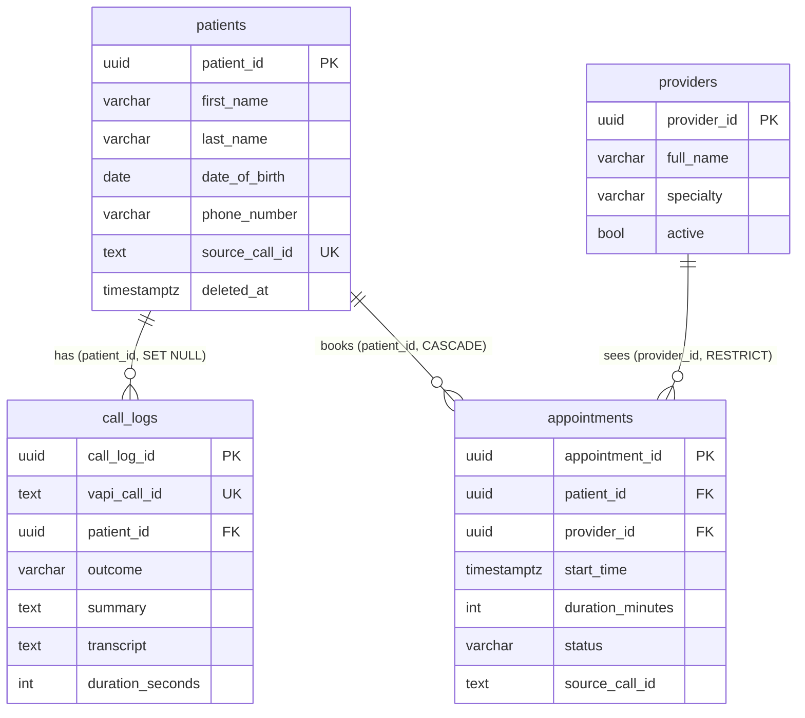

# Data model

Four tables: `patients` (core), `call_logs` (transcripts and outcomes),
`providers` and `appointments` (mock scheduling). Migrations 0001–0003. The reasoning is in
ADR [0003](adr/0003-patient-schema.md) (patients), [0007](adr/0007-call-logs-and-transcripts.md)
(call logs), and [0008](adr/0008-mock-appointment-scheduling.md) (scheduling).

## `patients`

"Enforced by" lists every layer that rejects a bad value for that column:
**App** = `app/validation/` (and, later, the Pydantic request schemas that call it);
**DB** = a CHECK constraint, `NOT NULL`, or trigger in the migration.

| Column | Type | Nullable | Enforced by | Notes |
|---|---|---|---|---|
| `patient_id` | `uuid` | no (PK) | DB (`gen_random_uuid()` default) | |
| `first_name` | `varchar(50)` | no | App + DB | `app.validation.names`; letters/spaces/hyphens/apostrophes, 1-50 chars |
| `last_name` | `varchar(50)` | no | App + DB | same rule as `first_name`; indexed via `lower(last_name)` |
| `date_of_birth` | `date` | no | App + DB (CHECK + trigger) | `app.validation.dates`; CHECK enforces `>= 1900-01-01`, trigger enforces "not in the future" (needs `CURRENT_DATE`, not CHECK-safe) |
| `sex` | `varchar(20)` | no | App + DB | `app.validation.demographics`; one of `Male`, `Female`, `Other`, `Decline to Answer` |
| `phone_number` | `varchar(10)` | no | App + DB | `app.validation.phone`; 10 digits, NANP; **not unique** (families share numbers) — see ADR 0003; partial index on non-deleted rows for duplicate-detection lookups |
| `email` | `varchar(254)` | yes | App | `app.validation.email` (pydantic `EmailStr`); no DB-level format CHECK (email formats are too varied for a regex to be reliable) |
| `address_line_1` | `varchar(100)` | no | App + DB | length only |
| `address_line_2` | `varchar(100)` | yes | — | |
| `city` | `varchar(100)` | no | App + DB | length only |
| `state` | `varchar(2)` | no | App + DB | `app.validation.address.US_STATES`; USPS code, 50 states + DC + PR/GU/VI/AS/MP |
| `zip_code` | `varchar(10)` | no | App + DB | `app.validation.address.validate_zip`; `NNNNN` or `NNNNN-NNNN` |
| `preferred_language` | `varchar(50)` | no | App | `app.validation.demographics.normalize_language`; defaults to `English` |
| `emergency_contact_name` | `varchar(50)` | yes | App + DB (when present) | same format as `first_name` |
| `emergency_contact_phone` | `varchar(10)` | yes | App + DB (when present) | same format as `phone_number` |
| `insurance_provider` | `varchar(100)` | yes | — | free text |
| `insurance_member_id` | `varchar(50)` | yes | App | `app.validation.insurance`; alphanumeric + hyphens, uppercased |
| `source_call_id` | `text` | yes (unique) | DB (`UNIQUE`) | Vapi `call.id`; makes voice "create" idempotent on retry |
| `created_at` | `timestamptz` | no | DB (`now()` default) | UTC |
| `updated_at` | `timestamptz` | no | DB (`BEFORE UPDATE` trigger, `clock_timestamp()`) | UTC; changes on every `UPDATE`, including manual ones |
| `deleted_at` | `timestamptz` | yes | — | soft delete marker; `NULL` = active |

## Indexes

| Index | Columns | Purpose |
|---|---|---|
| `pk_patients` | `patient_id` | primary key |
| `ix_patients_last_name_lower` | `lower(last_name)` | case-insensitive name lookup |
| `ix_patients_date_of_birth` | `date_of_birth` | lookup/duplicate-detection by DOB |
| `ix_patients_phone_number_active` | `phone_number` (partial: `WHERE deleted_at IS NULL`) | duplicate-detection by phone among active rows only |
| `uq_patients_source_call_id` | `source_call_id` | idempotent voice creates |

## Triggers

| Trigger | Fires on | Purpose |
|---|---|---|
| `patients_reject_future_dob` | `BEFORE INSERT OR UPDATE` | rejects `date_of_birth > CURRENT_DATE` (can't be a CHECK — see ADR 0003) |
| `patients_set_updated_at` | `BEFORE UPDATE` | sets `updated_at = clock_timestamp()` |

## `call_logs`

| Column | Type | Nullable | Enforced by | Notes |
|---|---|---|---|---|
| `call_log_id` | `uuid` | no (PK) | DB | `gen_random_uuid()` |
| `vapi_call_id` | `text` | no | DB (`UNIQUE`) | upsert key, since Vapi retries |
| `patient_id` | `uuid` | yes | DB (FK, `ON DELETE SET NULL`) | set when a save succeeds in the call |
| `outcome` | `varchar(20)` | no | DB CHECK | `registered`, `updated`, `abandoned`, `failed`, `in_progress` (default), `no_action` |
| `started_at`, `ended_at` | `timestamptz` | yes | — | from end-of-call-report |
| `duration_seconds` | `int` | yes | DB CHECK `>= 0` | computed from the timestamps |
| `ended_reason`, `language`, `summary`, `transcript`, `recording_url` | `text` | yes | — | transcript/summary may contain PHI |
| `created_at`, `updated_at` | `timestamptz` | no | DB (default, `set_updated_at` trigger) | |

Indexes: `patient_id`, `created_at`.

## `providers`

| Column | Type | Notes |
|---|---|---|
| `provider_id` | `uuid` PK | seeded by migration 0003 with fixed IDs |
| `full_name`, `specialty` | `varchar(100)` | |
| `active` | `bool` | default `true`; only active providers get slots |

## `appointments`

| Column | Type | Nullable | Enforced by | Notes |
|---|---|---|---|---|
| `appointment_id` | `uuid` | no (PK) | DB | |
| `patient_id` | `uuid` | no | DB (FK, `CASCADE`) | |
| `provider_id` | `uuid` | no | DB (FK, `RESTRICT`) | |
| `start_time` | `timestamptz` | no | App (signed slot_id) | always a generated 30-min slot |
| `duration_minutes` | `int` | no | DB CHECK `> 0` | default 30 |
| `reason` | `varchar(200)` | yes | App truncates, DB length | |
| `status` | `varchar(20)` | no | DB CHECK | `booked` (default) or `cancelled` |
| `source_call_id` | `text` | yes | — | per-call idempotency |
| `created_at`, `updated_at` | `timestamptz` | no | DB (default, trigger) | |

**Double-booking guard:** partial unique index `ux_appointments_provider_start_time_booked`
on `(provider_id, start_time) WHERE status = 'booked'`. The database, not the app,
guarantees one booking per slot under concurrency.
